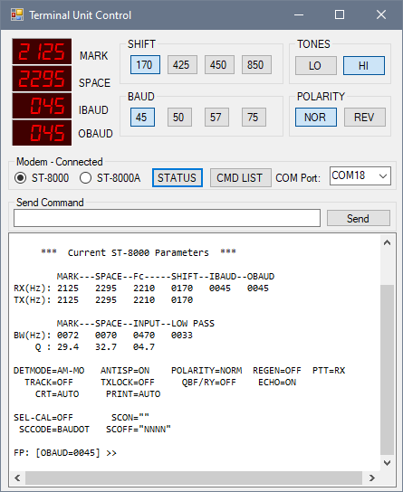

# tucontrol
Remote Control for HAL ST-8000 and ST-8000A Terminal Units
- Requires Digital-7 Mono Font for "LED" Display
- Basic Shift, Baud, Normal/reverse, High/Low Tones selected by pushbuttons.
- All TU commands are available from dropdown list
- Serial port is selectable, fixed 9600 baud

